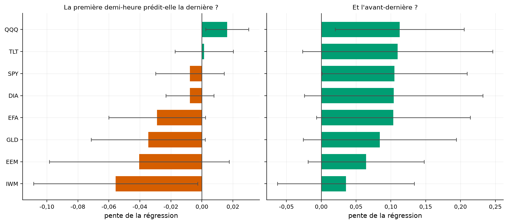
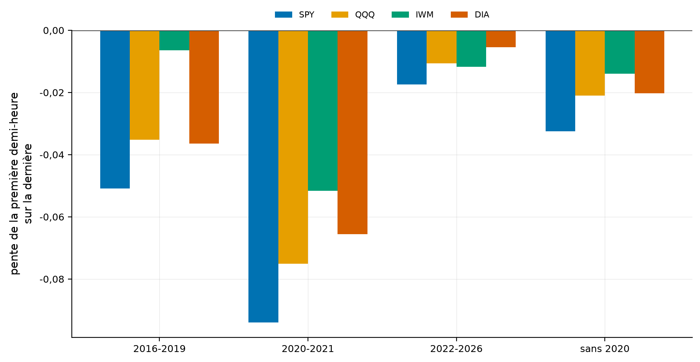
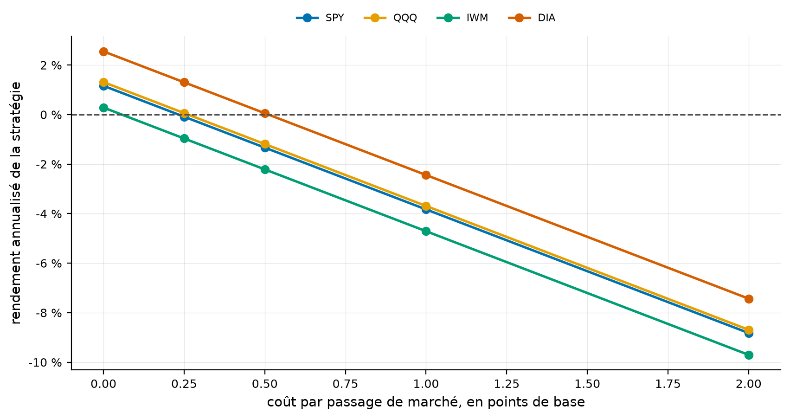
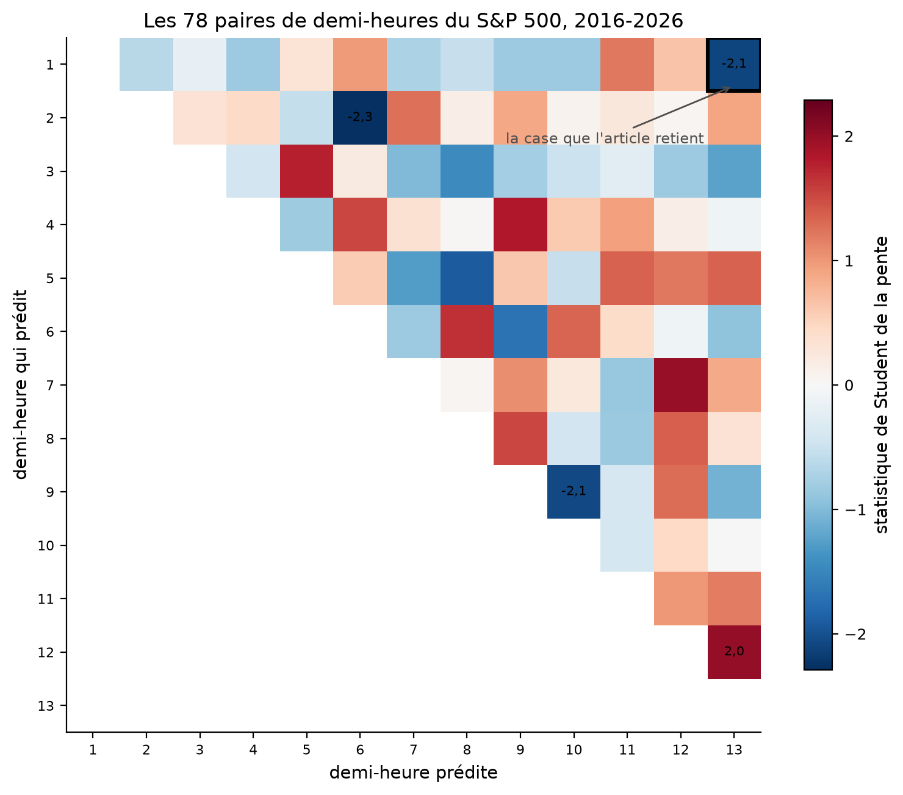
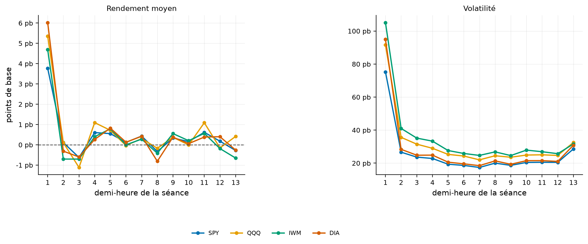

# La première demi-heure ne prédit plus la dernière, et ce n'est pas la nuance qu'on attendait

Un article très cité du Journal of Financial Economics montre qu'entre 1993 et 2013, la première
demi-heure de bourse prédisait la dernière. Rejoué sur 2016-2026 et sur huit fonds indiciels, **le
signe s'inverse sur six d'entre eux**, et il s'inverse le plus fort là où l'article disait son effet
le plus fort.

[](https://github.com/Guilou001/22-derniere-demi-heure/actions/workflows/ci.yml)


**Résultat en une phrase.** Sur 2 649 séances de 2016 à 2026 et huit fonds indiciels, la pente de la
première demi-heure sur la dernière est **négative pour six fonds sur huit**, de médiane −0,018, et
aucun fonds d'actions ne montre de pente positive ; ce qui subsiste, c'est un effet bien plus
modeste, l'avant-dernière demi-heure prédisant la dernière, **positif sur les huit** mais qui meurt à
**un quart de point de base** de coût par passage.

*Summary in English. Gao, Han, Li and Zhou (JFE 2018) document market intraday momentum: the first
half-hour return, measured from the previous close, predicts the last half-hour return on SPY over
1993-2013. Replayed on 2016-2026 across eight liquid ETFs and 2,649 sessions, the slope is negative
for six of eight, median −0.018, and no equity fund shows a positive slope. The reversal is
strongest precisely where the paper reported its effect strongest: high-volatility and high-volume
days. Decomposing the signal shows the overnight gap carries all of it, not the first half-hour of
trading. A weaker relation does survive, the twelfth half-hour predicting the thirteenth, positive on
all eight funds, but it breaks even at 0.23 to 0.51 basis points per trade. Finally, of the 78
half-hour pairs testable on SPY, four exceed a two standard error threshold where chance alone would
give 3.5.*

## 1. La question posée

**Ce que l'article affirme.** Son résumé, relevé le 30 août 2026 sur la notice EconPapers :

> the first half-hour return on the market as measured from the previous day's market close predicts
> the last half-hour return. This predictability, which is both statistically and economically
> significant, is stronger on more volatile days, on higher volume days, on recession days, and on
> major macroeconomic news release days. Intraday momentum also exists for ten other most actively
> traded domestic and international ETFs.

**En mots simples.** La séance américaine dure de 9 h 30 à 16 h, soit treize demi-heures. L'affirmation
est que si le marché monte le matin, il tend à monter encore juste avant la clôture. Assez pour qu'on
puisse en vivre, dit l'article.

**Un détail qui décide de tout.** Sa première demi-heure ne commence pas à l'ouverture : elle se
mesure **depuis la clôture de la veille**, donc elle contient la nuit. C'est écrit dans le résumé, et
c'est la première chose qu'une réplication rate.

**La question du dépôt.** Une anomalie publiée se juge sur ce qu'elle fait après sa publication, et
non sur la reproduction de ses propres chiffres. L'article s'arrête en 2013 ; ce dépôt commence en
2016.

## 2. D'où vient le projet, et ce qu'il apporte

Trois apports.

- **L'affirmation éprouvée sur huit fonds**, et non sur un seul, ce qui met à l'épreuve la
  généralisation que l'article annonce lui-même.
- **La décomposition du signal** entre la nuit et la première demi-heure de bourse, que l'article ne
  fait pas et qui change la lecture de l'effet.
- **La matrice complète des 78 paires de demi-heures**, qui situe la case retenue par l'article
  parmi toutes celles qu'on aurait pu retenir.

### Ce qui n'a pas été obtenu, et c'est un résultat

Les tables chiffrées de l'article n'ont pas pu être lues. Trois chemins essayés le 30 août 2026 :
l'éditeur oppose une vérification anti-robot, le dépôt SSRN refuse le téléchargement direct, et
l'adresse que le registre du portefeuille tenait pour un PDF universitaire rend en réalité une page
HTML de 138 370 octets. Les coefficients et statistiques publiés ne sont donc **pas** reproduits ici,
et ce dépôt ne le prétend pas. Ce qui est testé, ce sont les **affirmations** du résumé, sur une
fenêtre que l'article ne couvre pas.

## 3. Les données

Barres d'une minute du **flux consolidé**, de janvier 2016 au 28 août 2026, téléchargées chez Alpaca
par le client partagé du portefeuille.

| Fonds | Ce qu'il suit | Séances retenues |
|---|---|---:|
| SPY, QQQ, IWM | S&P 500, Nasdaq 100, Russell 2000 | 2 649 |
| DIA | Dow Jones | 1 864 |
| EEM, EFA | marchés émergents, marchés développés hors Amérique | 2 566 et 2 571 |
| GLD, TLT | or, obligations du Trésor à long terme | 2 560 et 2 444 |

Le flux consolidé et non celui d'IEX : mesuré le 30 août 2026, IEX ne capte que **1,81 %** du volume
consolidé et n'a vu aucune transaction sur **57 %** des minutes, si bien qu'un prix de fin de
demi-heure en serait souvent tiré d'une minute antérieure.

Des prix **bruts** et non ajustés : le dividende n'a pas d'effet à l'intérieur d'une séance, et les
deux fournisseurs de données n'entendent pas la même chose par « ajusté », un écart de onze points de
base à chaque détachement.

Le Dow Jones perd un quart de ses séances au filtre de complétude : c'est le moins échangé des huit,
et certaines de ses séances comptent moins de 390 barres d'une minute. Ce n'est pas un choix, c'est
une limite de ses données, et elle est déclarée.

## 4. La méthode, pas à pas

1. **Découper chaque séance en treize demi-heures**, chaque barre étant rangée dans la demi-heure où
   elle commence, la barre de 16 h qui porte l'enchère de clôture rejoignant la treizième.
2. **Vérifier l'identité** : les treize rendements doivent se composer exactement en le rendement de
   clôture à clôture. Un décalage d'une barre la briserait sans rien changer à la forme du tableau.
3. **Retirer les séances écourtées**, celles de veille de congé qui ferment à 13 h, où la dernière
   demi-heure n'existe pas.
4. **Régresser** la treizième demi-heure sur la première, avec des erreurs types de Newey et West :
   les jours agités arrivent en grappes, et l'erreur type ordinaire fabriquerait de la
   significativité là où il n'y a que de la persistance.
5. **Facturer la stratégie**, deux passages de marché par jour, et chercher le coût qui l'annule.

## 5. Les résultats

### 5.1 Le découpage se referme à la précision de la machine

Les treize rendements doivent se composer en le rendement du jour. Sur les huit fonds et les
19 952 séances, le pire écart vaut **1,1 × 10⁻¹⁵** et l'écart médian **2,2 × 10⁻¹⁶**.

Comment lire ce nombre, en trois constats. Le premier est que ce contrôle ne porte pas sur la théorie
mais sur le code : l'identité est vraie par construction, et un écart visible signalerait un décalage
d'une barre. Le deuxième est qu'aucun test de forme ne l'aurait vu, le tableau gardant le bon nombre
de lignes et les bonnes colonnes. Le troisième est qu'il tourne à chaque exécution, donc il ne peut
pas se périmer.

### 5.2 Six fonds sur huit ont la pente à l'envers

| Fonds | Ce qu'il suit | Pente | Erreur type | Student | Stratégie, par an |
|---|---|---:|---:|---:|---:|
| **SPY** | S&P 500 | **−0,056** | 0,027 | **−2,10** | −3,5 % |
| DIA | Dow Jones | −0,040 | 0,029 | −1,39 | −3,6 % |
| QQQ | Nasdaq 100 | −0,035 | 0,018 | −1,88 | −2,9 % |
| IWM | Russell 2000 | −0,029 | 0,016 | −1,86 | −3,9 % |
| EEM | marchés émergents | −0,008 | 0,008 | −1,00 | −1,8 % |
| EFA | marchés développés hors Amérique | −0,008 | 0,011 | −0,70 | −0,5 % |
| TLT | obligations du Trésor | +0,001 | 0,009 | +0,15 | +0,7 % |
| **GLD** | or | **+0,016** | 0,007 | **+2,35** | +1,4 % |

Comment lire ce tableau, en trois constats. Le premier est que **aucun des six fonds d'actions n'a de
pente positive** : l'affirmation de l'article ne survit pas, et pas seulement en perdant sa
significativité. Le deuxième est que le seul coefficient significativement positif est celui de l'or,
qui n'est pas un indice d'actions et qui est l'un de huit tests : à ce compte, un dépassement du
seuil est ce que le hasard donne, et il ne faut pas le lire autrement. Le troisième est que la
stratégie qui suivrait le signal perd de l'argent **avant même** de payer le moindre frais sur six
fonds sur huit.



Comment lire cette figure : une barre par fonds, la pente de la régression, avec deux erreurs types
de part et d'autre. À gauche le signal de l'article, à droite l'avant-dernière demi-heure. Les
couleurs distinguent le signe, non la significativité.

### 5.3 Le renversement tient à chaque sous-période

| Fonds | 2016-2019 | 2020-2021 | 2022-2026 | Sans 2020 |
|---|---:|---:|---:|---:|
| SPY | −0,051 | −0,094 | −0,017 | −0,033 (t = −2,55) |
| QQQ | −0,035 | −0,075 | −0,011 | −0,021 (t = −2,19) |
| IWM | −0,006 | −0,052 | −0,012 | −0,014 |
| DIA | −0,036 | −0,066 | −0,006 | −0,020 |

Comment lire ce tableau, en trois constats. Le premier est que **les seize cellules sont négatives**,
sans exception, ce qu'un simple effet de bruit ne produirait pas. Le deuxième est que retirer 2020,
l'année où l'on soupçonnerait un régime à part, ne rétablit rien : la pente reste négative et sa
statistique de Student **augmente** en valeur absolue, parce que retirer les séances les plus agitées
réduit surtout la variance. Le troisième est que l'effet s'atténue depuis 2022, en valeur absolue,
comme si le marché avait fini par digérer aussi le renversement.



Comment lire cette figure : quatre barres par période, une par fonds. Aucune ne dépasse zéro.

### 5.4 Le renversement est le plus fort là où l'article disait son effet le plus fort

L'article annonce que sa prédictibilité est « plus forte les jours plus volatils, les jours de plus
fort volume ». Découpé en tiers, sur le S&P 500 :

| Tiers | Par volatilité de la première demi-heure | Par volume de la première demi-heure |
|---|---:|---:|
| bas | +0,014 | +0,006 |
| moyen | −0,015 | **−0,057** (t = −3,41) |
| haut | **−0,059** (t = −2,03) | −0,061 |

Comment lire ce tableau, en trois constats. Le premier est que le conditionnement annoncé se
retrouve, **mais dans l'autre sens** : plus la séance est volatile ou active, plus la pente est
négative. Le deuxième est que le tiers le plus calme est le seul à donner une pente positive, et
qu'elle n'y est pas significative. Le troisième est que ce résultat est plus dérangeant que la simple
disparition de l'effet : une anomalie qui s'éteint se comprend, une anomalie qui s'inverse justement
là où elle était censée être la plus nette demande une autre explication.

### 5.5 Ce qui prédit n'est pas la demi-heure de bourse, c'est la nuit

La première demi-heure de l'article contient deux choses : l'écart entre la clôture de la veille et
l'ouverture, puis la première demi-heure de séance. Les séparer :

| Fonds | Depuis la veille | La nuit seule | La séance seule |
|---|---:|---:|---:|
| SPY | −0,056 (t = −2,10) | **−0,056 (t = −2,17)** | −0,070 (t = −1,19) |
| QQQ | −0,035 (t = −1,88) | **−0,037 (t = −1,98)** | −0,022 (t = −0,85) |
| IWM | −0,029 (t = −1,86) | **−0,033 (t = −1,94)** | −0,023 (t = −0,94) |
| DIA | −0,040 (t = −1,39) | −0,042 (t = −1,52) | −0,051 (t = −0,70) |

Comment lire ce tableau, en trois constats. Le premier est que **la nuit seule porte tout le signal**,
sa statistique de Student étant partout au moins aussi grande que celle du signal complet. Le deuxième
est que la première demi-heure de bourse, prise seule, ne dit rien : sa statistique ne dépasse jamais
1,2 en valeur absolue. Le troisième est ce que cela fait au nom : ce qui subsiste sur cette fenêtre
n'est pas un effet « intrajournalier » mais un lien entre l'écart d'ouverture et la clôture, ce qui
n'est pas la même chose et n'appelle pas la même explication.

### 5.6 Ce qui survit ne se monnaie pas

L'avant-dernière demi-heure, elle, prédit la dernière positivement sur **les huit fonds**, de médiane
+0,104. C'est un effet de continuation à très court terme, plus banal que celui de l'article. Il ne
résiste pas aux frais.

| Coût par passage | SPY | QQQ | IWM | DIA |
|---|---:|---:|---:|---:|
| 0 | +1,2 % | +1,3 % | +0,3 % | +2,6 % |
| 0,25 pb | −0,1 % | +0,1 % | −1,0 % | +1,3 % |
| 0,50 pb | −1,3 % | −1,2 % | −2,2 % | +0,1 % |
| 1 pb | −3,8 % | −3,7 % | −4,7 % | −2,4 % |

Comment lire ce tableau, en trois constats. Le premier est que le seuil de rentabilité vaut **de 0,06
à 0,51 point de base par passage** selon le fonds, alors qu'une position par jour en demande deux. Le
deuxième est que ce seuil est du même ordre que l'écart entre les meilleurs prix acheteur et vendeur
sur ces fonds, donc qu'il ne laisse rien pour l'impact ni pour la commission. Le troisième est que le
meilleur des quatre, le Dow Jones, est aussi celui dont les données sont les plus lacunaires, ce qui
n'incite pas à s'y fier.



Comment lire cette figure : une ligne par fonds, le rendement annualisé contre le coût. Les quatre
lignes passent sous zéro avant un point de base.

### 5.7 La case retenue par l'article n'est pas remarquable dans sa matrice

Treize demi-heures donnent **78 paires** dont la première pourrait prédire la seconde. L'article en
retient une. Toutes éprouvées sur le S&P 500 de 2016 à 2026 :

| Compte | Valeur |
|---|---:|
| Paires éprouvées | 78 |
| Au-delà de deux erreurs types | **4** |
| Attendues par le seul hasard | **3,5** |

Comment lire ce tableau, en trois constats. Le premier est que le nombre de cases significatives est
celui que le hasard donne, à un demi près : sur cette fenêtre, **rien ne dépasse le bruit** dans la
matrice entière. Le deuxième est que la case de l'article, la première prédisant la treizième, y
figure bien parmi les quatre, mais du mauvais côté et sans y être la plus forte. Le troisième est que
ce compte ne dit rien contre l'article, dont l'échantillon est autre et dont la case était choisie
pour une raison théorique ; il dit ce qu'il faudrait exiger d'une découverte faite sur cette
fenêtre-ci.



Comment lire cette figure : chaque case porte la statistique de Student de la régression d'une
demi-heure sur une autre, le rouge pour une pente positive et le bleu pour une négative. Seules les
cases qui dépassent deux erreurs types portent leur chiffre. Le cadre noir marque celle que l'article
retient.



Comment lire cette figure : la première et la dernière demi-heure concentrent le mouvement et la
volatilité, ce qui explique pourquoi la littérature s'y intéresse, et pourquoi les frais y sont aussi
les plus visibles.

## 6. Reproduire

```bash
uv sync --locked --all-extras
uv run pytest                 # 21 tests fermés, sans réseau ni données de marché
uv run dmh fetch              # les huit fonds, barres d'une minute, environ 12 millions
uv run dmh tout               # les cinq études et les cinq figures
```

Le téléchargement demande une clé Alpaca, à poser dans l'environnement ou dans un fichier local que
le client partagé lit. Les tests, eux, tournent sur des séances fabriquées dont chaque réponse se
calcule de tête. Tous les chiffres de ce README viennent des fichiers de `results/`.

## 7. Limites, avec leur statut

| Limite | Statut |
|---|---|
| Les chiffres publiés par l'article n'ont pas été obtenus | mesuré ; trois chemins essayés, tous fermés, et ce dépôt teste donc les affirmations du résumé et non les coefficients |
| Huit fonds et deux signaux font seize tests | déclaré ; le seul coefficient significativement positif, celui de l'or, est ce que le hasard donne à ce compte, et il est lu ainsi |
| Le Dow Jones perd un quart de ses séances au filtre de complétude | mesuré ; c'est le moins échangé des huit, et ses résultats sont donnés mais pas mis en avant |
| Les jours de récession et d'annonce macroéconomique ne sont pas testés | déclaré ; le résumé les cite, et les dater demanderait un calendrier que ce dépôt n'a pas construit |
| Le coût est modélisé comme une fraction fixe du montant | déclaré ; l'impact de marché d'un ordre de clôture croît avec la taille, ce que ce modèle ignore, donc le seuil publié est un plafond optimiste |
| La fenêtre commence en 2016 | mesuré ; c'est la profondeur du flux consolidé du fournisseur, et 2014-2015 manquerait pour combler l'écart avec l'échantillon de l'article |
| Les erreurs types supposent les séances indépendantes au-delà de quelques jours | déclaré ; la correction de Newey et West couvre une dizaine de retards, choisie par la règle usuelle |
| Aucun test de l'effet sur des contrats à terme | déclaré ; la préimpression de 2026 citée en section 8 le fait sur le Nasdaq et n'y trouve rien non plus |

## 8. Crédits, licence, citation

Lei Gao, Yufeng Han, Sophia Zhengzi Li et Guofu Zhou, « Market intraday momentum », *Journal of
Financial Economics*, volume 129, numéro 2, 2018, pages 394 à 414
([notice EconPapers](https://econpapers.repec.org/RePEc:eee:jfinec:v:129:y:2018:i:2:p:394-414)).

Deux points de comparaison ouverts, lus en entier :
[Manapon Limkriangkrai, Daniel Chai et Gaoping Zheng, « Market intraday momentum: APAC evidence »,
*Pacific-Basin Finance Journal* 80, 2023](https://researchmgt.monash.edu/ws/files/519509174/494419119_oa.pdf),
réplication déclarée qui trouve l'effet en Chine et au Japon, faiblement en Corée du Sud, et pas du
tout à Hong Kong ni à Singapour ; et
[Mathias Mesfin, « Structural Limits of OHLCV-Based Intraday Signals in MNQ Futures », arXiv
2605.04004, mai 2026](https://arxiv.org/abs/2605.04004), préimpression non revue par les pairs, qui
éprouve quatorze familles de signaux intrajournaliers sur 947 séances de contrats à terme du Nasdaq
et n'en retient aucune, l'avantage brut plafonnant entre 0,07 et 1,50 point quand les frais
aller-retour en coûtent 2,0.

Données de marché : flux consolidé d'Alpaca, compte gratuit, usage personnel. Aucune barre n'est
redistribuée. Code sous licence MIT, rapport sous licence CC BY 4.0. Figures et client de données
produits par [gv-fintools](https://github.com/Guilou001/gv-fintools).

Voisinage dans le portefeuille :
[23-fnb-levier-quotidien](https://github.com/Guilou001/23-fnb-levier-quotidien) mesure l'érosion des
fonds à levier, l'autre promesse intrajournalière du programme.
[08-facteurs-canada](https://github.com/Guilou001/08-facteurs-canada) pose la même question à
l'échelle mensuelle : une prime publiée survit-elle à sa publication. Le rapport
`rapport/rapport.pdf` est engendré depuis ce README.
